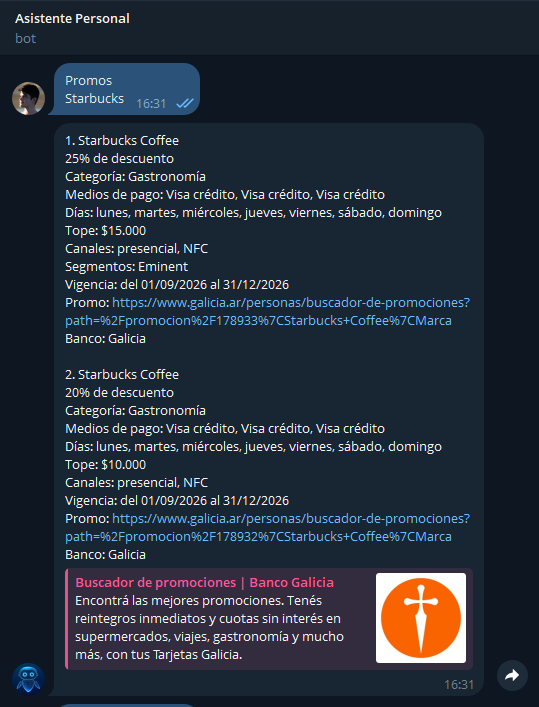
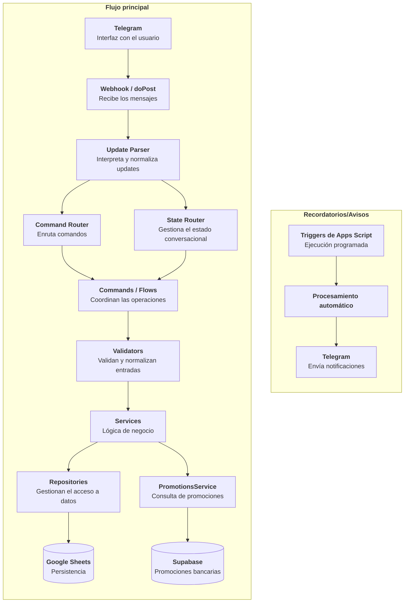

<p align="center">
  <a href="README.md">🇬🇧 English</a> |
  <a href="README.es.md">🇦🇷 Español</a>
</p>

<p align="center">
  
</p>


# Descripción 

Un asistente personal controlado desde Telegram que integra distintos módulos y herramientas que uso a diario para simplificar tareas de registro y automatizar procesos, dándoles una interfaz común y sencilla de utilizar.

Actualmente incluye herramientas de gestión de finanzas personales, un sistema de recordatorios y un módulo de consulta de promociones bancarias integrado con un proyecto independiente. La arquitectura está pensada para poder incorporar nuevas funcionalidades de forma progresiva sin concentrar toda la lógica en un único módulo.

# Decisiones de diseño

## Telegram como interfaz

Telegram permite disponer de una interfaz accesible desde cualquier dispositivo sin desarrollar y mantener un frontend independiente, lo cual me permite destinar todo el tiempo de desarrollo a las distintas herramientas y utilidades del asistente.

## Google Sheets como persistencia

Para los módulos de finanzas y recordatorios, Google Sheets ofrece una solución simple, visible y fácilmente editable sin necesidad de mantener infraestructura adicional.

El acceso está encapsulado mediante repositories para reducir el acoplamiento entre la persistencia y las reglas de negocio.

# Funcionalidades actuales

## Finanzas

El módulo financiero permite administrar distintos aspectos de las finanzas personales directamente desde Telegram.

Entre sus funcionalidades se encuentran:

- Registro de gastos e ingresos: permite guardar detalles como fecha, monto, categoría, descripción y si hubo algún reintegro o descuento (esto último sirve para poder hacer un seguimiento en el caso de que el reintegro sea posterior a la compra).
- Registro de gastos con tarjeta de crédito: permite indicar la tarjeta utilizada y la cantidad de cuotas, información que luego se utiliza para generar los resúmenes de cada tarjeta.
- Administración de tarjetas, fechas de cierre, vencimientos.
- Armado de resúmenes de tarjetas para saber cuánto hay que pagar de cada una.
- Registro de deudas, deudores y pagos de deudas: sirve para llevar registro de lo que debo o me deben. 
- Totales de gastos e ingresos mensuales.
- Formatos rápidos para registrar operaciones frecuentes.
- Avisos automáticos para eventos relevantes, como fechas de cierre o vencimiento de tarjetas.

Algunas operaciones utilizan flujos conversacionales de varios pasos para solicitar únicamente la información necesaria en cada momento.

Por ejemplo:

```text
Crear ingreso -> Elegir categoría -> Guardar
```

## Recordatorios

El asistente permite crear recordatorios directamente desde Telegram junto con una descripción, frecuencia y horario.

Actualmente soporta distintos tipos de frecuencias:

- Semanal.
- Mensual.
- Cada N días.
- Fecha única.
- Varios días específicos de la semana.

Los recordatorios son procesados automáticamente mediante triggers de Google Apps Script y enviados por Telegram cuando corresponde.

## Promociones bancarias

El asistente permite buscar descuentos y beneficios bancarios directamente desde Telegram mediante una integración con [Promociones Bancarias](https://github.com/PabloBottinelli/promociones-bancarias), un proyecto independiente que estoy desarrollando en Python.

El sistema recopila y normaliza promociones de diferentes bancos argentinos, almacena la información en Supabase y la actualiza mediante procesos automatizados.

El asistente consulta esa información a través de la API REST de Supabase, utilizando una función RPC para realizar búsquedas por palabras clave.

Las promociones encontradas se presentan en Telegram con información relevante, como descuentos, medios de pago, cuotas sin interés, días de aplicación, topes de reintegro, vigencia y condiciones.

Por ejemplo:

<p align="left">
  
</p>

# Arquitectura

El proyecto fue evolucionando desde una implementación procedural hacia una arquitectura modular con responsabilidades separadas.



# Ejemplo de uso

Ejemplo de registro de un ingreso y consulta posterior de la información almacenada.

<p align="center">
  
</p>

# Testing

El proyecto utiliza **Vitest** y un entorno simulado de Google Sheets para poder probar la lógica localmente sin depender de una hoja real.

La suite cubre todas las funcionalidades principales, aunque todavía queda mejorar la cobertura y reducir la dependencia de valores hardcodeados y condiciones variables —como la fecha actual— que pueden volver algunos tests frágiles con el tiempo.

El proyecto incluye herramientas para generar reportes de cobertura:


Además existen comandos auxiliares para comparar reportes de cobertura antes y después de realizar modificaciones.

# Evolución del proyecto

La idea original era desarrollar una aplicación de gestión financiera con una interfaz gráfica propia. Sin embargo, rápidamente me di cuenta de que estaba dedicando demasiado tiempo al diseño de la interfaz y no tanto al desarrollo de las funcionalidades que realmente quería usar.

A partir de eso surgió la idea de utilizar Telegram como interfaz, lo que me permitió concentrarme en la lógica y las automatizaciones, implementar nuevas herramientas más rápido y empezar a utilizar el proyecto desde etapas tempranas.

Con el tiempo fui incorporando nuevas funcionalidades financieras, un sistema de recordatorios, tests automatizados y fui pasando a una arquitectura más modular.

Así, el proyecto dejó de ser únicamente una herramienta para registrar y administrar gastos y pasó a convertirse en un asistente personal extensible, pensado para integrar distintas herramientas y automatizaciones bajo una misma interfaz.

# Próximas mejoras

- Simplificar la incorporación de nuevos módulos.
- Mejorar el manejo centralizado de configuración.
- Ampliar la cobertura de tests.
- Automatizar verificaciones antes de cada deployment.
- Mejorar la observabilidad y el manejo de errores.
- Desacoplar progresivamente funcionalidades que puedan convertirse en servicios independientes.
- Incorporar nuevas herramientas de visualización de datos.
- Simplificar la forma de interactuar con el asistente.

# Autor

| [<br><sub>Pablo Bottinelli</sub>](https://github.com/PabloBottinelli) |
| :---: |