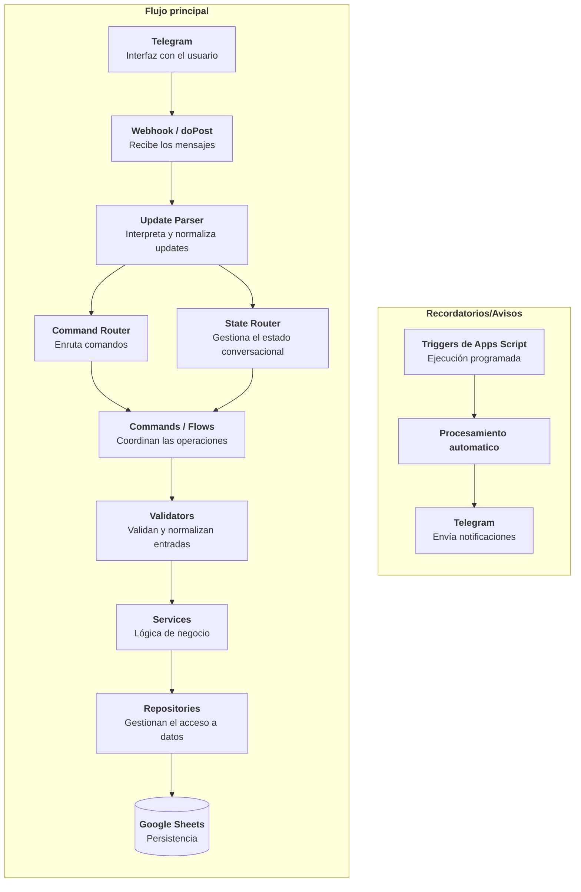
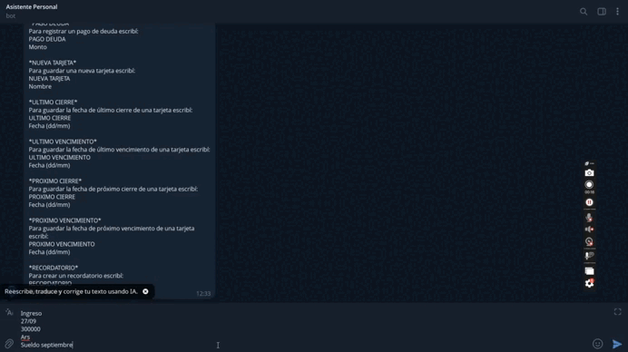

<p align="center">
  
</p>


# Descripción 

Un asistente personal controlado desde Telegram que integra distintos módulos y herramientas que uso a diario para simplificar tareas de registro y automatizar procesos, dándoles una interfaz común y sencilla de utilizar.

Actualmente incluye un módulo completo de gestión de finanzas personales (con unas cuantas mejoras y ampliaciones a realizar) y un sistema de recordatorios, pero la idea es poder incorporar nuevas funcionalidades de forma progresiva sin concentrar toda la lógica en un único módulo.

# Decisiones de diseño

## Telegram como interfaz

Telegram permite disponer de una interfaz accesible desde cualquier dispositivo sin desarrollar y mantener un frontend independiente, lo cual me permite destinar todo el tiempo de desarrollo a las distintas herramientas y utilidades del asistente.

## Google Sheets como persistencia

Para los módulos actuales, Google Sheets ofrece una solución simple, visible y fácilmente editable sin necesidad de mantener infraestructura adicional.

El acceso está encapsulado mediante repositories para reducir el acoplamiento entre la persistencia y las reglas de negocio.

# Funcionalidades actuales

## Finanzas

El módulo financiero permite administrar distintos aspectos de las finanzas personales directamente desde Telegram.

Entre sus funcionalidades se encuentran:

- registro de gastos;
- registro de ingresos;
- registro de gastos con tarjeta de crédito;
- administración de tarjetas;
- fechas de cierre y vencimiento;
- armado de resúmenes de tarjetas;
- categorías personalizadas;
- descuentos y reintegros;
- manejo de deudas y deudores;
- totales de gastos e ingresos mensuales;
- soporte para distintas monedas;
- formatos rápidos para registrar operaciones frecuentes.
- triggers de avisos relevantes

Algunas operaciones utilizan flujos conversacionales de varios pasos para solicitar únicamente la información necesaria en cada momento.

Por ejemplo:

```text
Crear ingreso -> Elegir categoría -> Guardar
```

## Recordatorios

El asistente permite crear recordatorios directamente desde Telegram junto con una descripción, frecuencia y horario.

Actualmente soporta distintos tipos de frecuencias:

- semanal;
- mensual;
- cada N días;
- fecha única;
- varios días específicos de la semana.

Los recordatorios son procesados automáticamente mediante triggers de Google Apps Script y enviados por Telegram cuando corresponde.

# Arquitectura

El proyecto fue evolucionando desde una implementación procedural hacia una arquitectura modular con responsabilidades separadas.



# Ejemplo de uso

El bot guía al usuario durante el registro y permite consultar posteriormente la información almacenada.

<p align="center">
  
</p>

# Testing

El proyecto utiliza **Vitest** y un entorno simulado de Google Sheets para poder probar la lógica localmente sin depender de una hoja real.

La suite cubre todas las funcionalidades principales, aunque todavía queda mejorar la cobertura y reducir la dependencia de valores hardcodeados y condiciones variables —como la fecha actual— que pueden volver algunos tests frágiles con el tiempo.


| Métrica | Cobertura | Cubiertos |
| --- | ---: | ---: |
| Statements | **87.54%** | 1758 / 2008 |
| Branches | **71.49%** | 760 / 1063 |
| Functions | **90.60%** | 347 / 383 |
| Lines | **89.64%** | 1688 / 1883 |

## Ejecutar los tests

```bash
npm install
npm test
```

Modo watch:

```bash
npm run test:watch
```

## Coverage

El proyecto incluye herramientas para generar reportes de cobertura:

```bash
npm run coverage
```

También existen comandos auxiliares para comparar reportes de cobertura antes y después de modificaciones.

# Instalación

## 1. Clonar el repositorio

```bash
git clone https://github.com/PabloBottinelli/telegram-personal-assistant.git
cd telegram-personal-assistant
```

## 2. Instalar las dependencias de desarrollo

```bash
npm install
```

## 3. Configurar Google Apps Script

El proyecto utiliza `clasp` para trabajar localmente con Google Apps Script.

Los archivos locales de autenticación y configuración sensible no forman parte del repositorio.

Entre ellos:

```text
.clasp.json
.clasprc.json
env.js
```

## 4. Configurar Telegram

Para ejecutar el bot es necesario configurar:

- crear bot de telegram con @BotFather
- obtener token del bot de Telegram;
- obtener id del chat autorizado;
- proyecto correspondiente de Google Apps Script;
- Google Sheets utilizado para la persistencia.

Las credenciales deben mantenerse fuera del control de versiones.

## 5. Sincronizar con Apps Script

Una vez configurado `clasp`:

```bash
clasp push
```

El proyecto puede desplegarse como una Web App de Google Apps Script para recibir los updates enviados por Telegram.

# Evolución del proyecto

La idea original era desarrollar una aplicación de gestión financiera con una interfaz gráfica propia. Sin embargo, rápidamente me di cuenta de que estaba dedicando demasiado tiempo al diseño de la interfaz y no tanto al desarrollo de las funcionalidades que realmente quería usar.

A partir de eso surgió la idea de utilizar Telegram como interfaz, lo que me permitió concentrarme en la lógica y las automatizaciones, implementar nuevas herramientas más rápido y empezar a utilizar el proyecto desde etapas tempranas.

Con el tiempo fui incorporando nuevas funcionalidades financieras, un sistema de recordatorios, tests automatizados y fuí pasando a una arquitectura más modular.

Así, el proyecto dejó de ser únicamente una herramienta para registrar y administrar gastos y pasó a convertirse en un asistente personal.

# Próximas mejoras

- simplificar la incorporación de nuevos módulos;
- mejorar el manejo centralizado de configuración;
- ampliar la cobertura de tests;
- automatizar verificaciones antes de cada deployment;
- mejorar observabilidad y manejo de errores;
- desacoplar progresivamente funcionalidades que puedan convertirse en servicios independientes;
- incorporar nuevas herramientas de visualización de datos;
- simplificar la forma de interactuar con el asistente;

# Autor

| [<br><sub>Pablo Bottinelli</sub>](https://github.com/PabloBottinelli) |
| :---: |