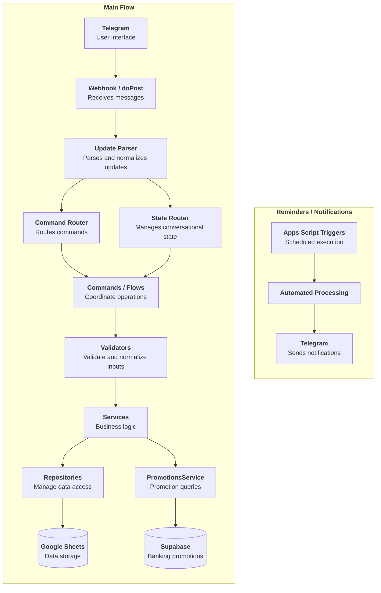

<p align="center">
  <a href="README.md">🇬🇧 English</a> |
  <a href="README.es.md">🇦🇷 Español</a>
</p>

<p align="center">
  
</p>


# Description

A personal assistant controlled through Telegram that integrates various modules and everyday tools to simplify data entry and automate workflows, providing a single, easy-to-use interface.

It currently includes personal finance management tools, a reminder system, and a banking promotions search module integrated with a separate project. The architecture is designed to support the gradual addition of new features without concentrating all the logic in a single module.

# Design Decisions

## Telegram as the Interface

Telegram provides an interface accessible from any device without the need to develop and maintain a separate frontend. This allows me to focus development efforts on the assistant's features and utilities rather than on building a user interface.

## Google Sheets as Data Storage

For the finance and reminder modules, Google Sheets provides a simple, transparent, and easily editable storage solution without requiring additional infrastructure.

Data access is encapsulated through repositories to reduce coupling between the persistence layer and business logic.

# Current Features

## Personal Finance

The finance module allows users to manage different aspects of their personal finances directly through Telegram.

Its main features include:

* **Expense and income tracking:** Records details such as date, amount, category, description, and any applicable discount or cashback. It also allows tracking cashback payments that are credited after the purchase.
* **Credit card expense tracking:** Records the card used and the number of installments, which are then used to generate credit card statements.
* **Credit card management:** Tracks cards, statement closing dates, and payment due dates.
* **Credit card statements:** Calculates the amounts due for each credit card.
* **Debt management:** Tracks debts, money owed by others, and debt repayments.
* **Monthly summaries:** Provides monthly expense and income totals.
* **Quick-entry formats:** Simplifies the registration of frequent transactions.
* **Automated notifications:** Sends alerts for relevant events, such as credit card statement closing dates and payment deadlines.

Some operations use multi-step conversational flows to request only the information needed at each stage.

For example:

```text
Create income -> Select category -> Save
```

## Reminders

The assistant allows users to create reminders directly through Telegram by specifying a description, frequency, and time.

It currently supports several scheduling options:

* Weekly.
* Monthly.
* Every N days.
* One-time reminders.
* Specific days of the week.

Reminders are automatically processed using Google Apps Script triggers and sent through Telegram when scheduled.

## Banking Promotions

The assistant allows users to search for banking discounts and benefits directly through Telegram by integrating with [Banking Promotions](https://github.com/PabloBottinelli/promociones-bancarias), a separate project I am developing in Python.

The system collects and normalizes promotions from different Argentine banks, stores the information in Supabase, and keeps it updated through automated processes.

The assistant retrieves this information through the Supabase REST API, using an RPC function to perform keyword-based searches.

Matching promotions are displayed in Telegram with relevant details, including discounts, payment methods, interest-free installments, applicable days, cashback limits, validity periods, and conditions.

For example:

<p align="left">
  
</p>

# Architecture

The project has evolved from a procedural implementation into a modular architecture with clearly separated responsibilities.



# Usage Example

Example of recording an income transaction and subsequently retrieving the stored information.

<p align="center">
  
</p>

# Testing

The project uses **Vitest** and a simulated Google Sheets environment to test business logic locally without relying on a real spreadsheet.

The test suite covers all major features, although there is still room to improve coverage and reduce dependencies on hardcoded values and variable conditions, such as the current date, which can make some tests fragile over time.

The project includes tools for generating test coverage reports:


Additional utility commands are available to compare coverage reports before and after making changes.

# Project Evolution

The original idea was to develop a personal finance management application with its own graphical interface. However, I quickly realized that I was spending too much time designing the interface rather than developing the features I actually wanted to use.

This led me to adopt Telegram as the interface, allowing me to focus on business logic and automation, implement new tools faster, and start using the project from its early development stages.

Over time, I added new financial features, a reminder system, automated tests, and gradually refactored the codebase toward a more modular architecture.

The project eventually evolved from a simple expense-tracking tool into an extensible personal assistant designed to integrate different utilities, automations, and external services through a single interface.

# Future Improvements

* Simplify the process of adding new modules.
* Improve centralized configuration management.
* Expand test coverage.
* Automate checks before each deployment.
* Improve observability and error handling.
* Gradually decouple features that could become independent services.
* Introduce new data visualization tools.
* Simplify user interactions with the assistant.

# Author

| [<br><sub>Pablo Bottinelli</sub>](https://github.com/PabloBottinelli) |
| :---------------------------------------------------------------------------------------------------------------------------------: |
